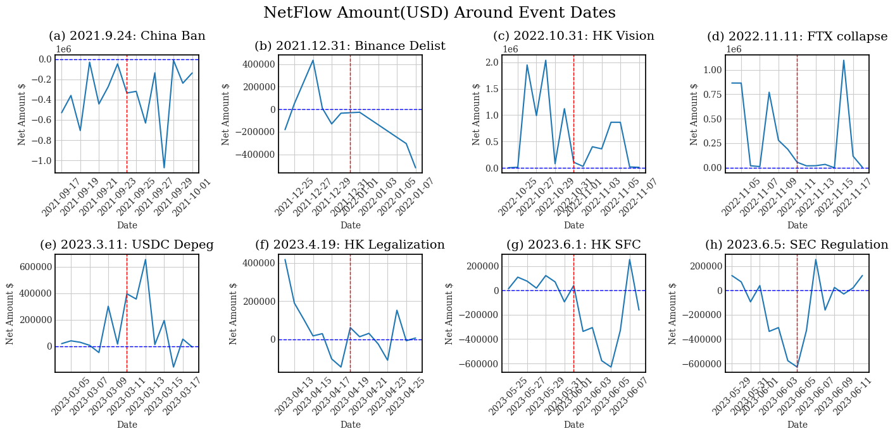

# The Impact of Incidents on Crypto Markets: An Analysis of CeFi and DeFi Trust Mechanism 

## *Supplementary resources, data, and code*
by **Xintong Wu**, **Wanlin Deng**, **Yutong Quan** and **Luyao Zhang***

(* *the corresponding author: lz183@duke.edu*)

 

*Figure 1. Overview of the article: created by [Whimsical](https://whimsical.com/).*

## Table of Contents
- [Data](https://github.com/SciEcon/IncidentsAnalysis2023/tree/main#data)
- [Code](https://github.com/SciEcon/IncidentsAnalysis2023/tree/main#code)
- [Images]()
- [Reference](https://github.com/SciEcon/IncidentsAnalysis2023/tree/main#references)

## Data
 

*Figure 2. Data collected flowchart: created by [Whimsical](https://whimsical.com/).*

### Collected Data

For collecting data from the flipside, please refer to [**flipsidecrypto.xyz**](https://flipsidecrypto.xyz/siavashj/cex-to-dex-and-dex-to-cex-cex-to-dex-and-dex-to-cex-arIDpY).

#### Meta Data Infomation

| Data Files  | Data Type | Data Content |
| ------------- | ------------- | ------------- |
| [1_Price.csv](https://github.com/SciEcon/IncidentsAnalysis2023/blob/main/Data/collected/1_Price.csv)  | Queried  | WETH Daily Price  |
| [2_CEX_to_DEX.csv](https://github.com/SciEcon/IncidentsAnalysis2023/blob/main/Data/collected/2_CEX_to_DEX.csv)  | Queried  | CEX to DEX Transaction Flow  |
| [2_DEX_to_CEX.csv](https://github.com/SciEcon/IncidentsAnalysis2023/blob/main/Data/collected/2_DEX_to_CEX.csv)  | Queried  | DEX to CEX Transaction Flow  |
| [2_Netflow.csv](https://github.com/SciEcon/IncidentsAnalysis2023/blob/main/Data/collected/2_Netflow.csv)  | Queried  | NetFlow  |

#### Data Dictionary
- **WETH Daily Price**

| Variable Name          | Description           | Frequency | Unit | Type |
|------------------------|-----------------------|-----------|------|------|
| DATE                   | Date of price      | Daily     | Date | Date |
| Price                  | Daily price of WETH   | Daily     | USD | Numeric |

- **Transaction between CEX and DEX**
 
| Variable Name          | Description           | Frequency | Unit | Type |
|------------------------|-----------------------|-----------|------|------|
| DATE                   | Date of transfer      | Daily     | Date | Date |
| N\_TRANSFER            | Number of transfers   | Daily     | Count| Integer |
| USER                   | User identifier      | Daily     | Count | Integer |
| AMOUNT\_USD            | Amount in USD         | Daily     | USD  | Numeric |
| AMOUNT\_ETH            | Amount in ETH         | Daily     | ETH  | Numeric |
| CEX                    | Centralized Exchange  | Daily     | Text | Categorical | 
| DEX                    | Decentralized Exchange| Daily     | Text | Categorical |

- **Netflow between CEX and DEX**
  
| Variable Name         | Description            | Frequency | Unit     | Type    | 
| --------------------- | ---------------------- | --------- | -------- | ------- |
| DATE                  | Transaction Date       | Daily     | Date     | Date    | 
| USER $\rightarrow$ DEX | User Interaction with DEX | Daily  | Count    | Integer |
| USER $\rightarrow$ CEX | User Interaction with CEX | Daily  | Count    | Integer |
| Net User              | Net User Interaction    | Daily     | Count    | Integer |
| Amount $\rightarrow$ DEX | Amount Related to DEX | Daily | USD      | Numeric |
| Amount $\rightarrow$ CEX | Amount Related to CEX | Daily | USD      | Numeric |
| Net Amount ETH        | Net ETH Amount          | Daily     | ETH      | Numeric |
| Amount \$ $\rightarrow$ DEX | Amount in USD Related to DEX | Daily | USD | Numeric |
| Amount \$ $\rightarrow$ CEX | Amount in USD Related to CEX | Daily | USD | Numeric |
| Net Amount \$         | Net USD Amount          | Daily     | USD      | Numeric |

### Analyzed Data
- **Data File Information**

| **DeFi Protocols** | **Data File** | **Description** |
| ------- | ------- | ------- |
| **Aave** | [aave_cleaned_discord.csv](https://github.com/SciEcon/BlockchainSentiment2023/blob/main/Data/analyzed/aave_cleaned_discord.csv) | This file provided the preprocessed content from the collected dataset of Aave. | 
| | [aave_daily_sentiment.csv](https://github.com/SciEcon/BlockchainSentiment2023/blob/main/Data/analyzed/aave_daily_sentiment.csv) | This file contains the daily sentiment score of discussion in the Aave community on Discord. | 
| | [aave_user_sentiment.csv](https://github.com/SciEcon/BlockchainSentiment2023/blob/main/Data/analyzed/aave_user_sentiment.csv) | This file includes the user-based sentiment score of discussion in the Aave community on Discord. | 
| | [aave_volume_discord.csv](https://github.com/SciEcon/BlockchainSentiment2023/blob/main/Data/analyzed/aave_volume_discord.csv) | This file presents the daily discussion volume for the Aave community on Discord. | 
| **Uniswap** | [uniswap_cleaned_discord.csv](https://github.com/SciEcon/BlockchainSentiment2023/blob/main/Data/analyzed/uniswap_cleaned_discord.csv) | This file provided the preprocessed content from the collected dataset of Uniswap. | 
| | [uniswap_daily_sentiment.csv](https://github.com/SciEcon/BlockchainSentiment2023/blob/main/Data/analyzed/uniswap_daily_sentiment.csv) | This file includes the user-based sentiment score of discussion in the Uniswap community on Discord. | 
| | [uniswap_user_sentiment.csv](https://github.com/SciEcon/BlockchainSentiment2023/blob/main/Data/analyzed/uniswap_user_sentiment.csv) | This file presents the daily discussion volume for the Uniswap community on Discord. | 
| | [uniswap_volume_discord.csv](https://github.com/SciEcon/BlockchainSentiment2023/blob/main/Data/analyzed/uniswap_volume_discord.csv) | This file presents the daily discussion volume for the Uniswap community on Discord. | 
| **Curve Dao** | [curve_cleaned_discord.csv](https://github.com/SciEcon/BlockchainSentiment2023/blob/main/Data/analyzed/curve_cleaned_discord.csv) | This file provided the preprocessed content from the collected dataset of Curve Dao. | 
| | [curve_daily_sentiment.csv](https://github.com/SciEcon/BlockchainSentiment2023/blob/main/Data/analyzed/curve_daily_sentiment.csv) | This file includes the user-based sentiment score of discussion in the Curve Dao community on Discord. | 
| | [curve_user_sentiment.csv](https://github.com/SciEcon/BlockchainSentiment2023/blob/main/Data/analyzed/curve_user_sentiment.csv) | This file presents the daily discussion volume for the Curve Dao community on Discord. | 
| | [curve_volume_discord.csv](https://github.com/SciEcon/BlockchainSentiment2023/blob/main/Data/analyzed/curve_volume_discord.csv) | This file presents the daily discussion volume for the Curve Dao community on Discord. | 
| **Aragon** | [aragon_cleaned_discord.csv](https://github.com/SciEcon/BlockchainSentiment2023/blob/main/Data/analyzed/aragon_cleaned_discord.csv) | This file provided the preprocessed content from the collected dataset of Aragon. | 
| | [aragon_daily_sentiment.csv](https://github.com/SciEcon/BlockchainSentiment2023/blob/main/Data/analyzed/aragon_daily_sentiment.csv) | This file includes the user-based sentiment score of discussion in the Aragon community on Discord. | 
| | [aragon_user_sentiment.csv](https://github.com/SciEcon/BlockchainSentiment2023/blob/main/Data/analyzed/aragon_user_sentiment.csv) | This file presents the daily discussion volume for the Aragon community on Discord. | 
| | [aragon_volume_discord.csv](https://github.com/SciEcon/BlockchainSentiment2023/blob/main/Data/analyzed/aragon_volume_discord.csv) | This file presents the daily discussion volume for the Aragon community on Discord. | 
| **Yearn Finance** | [yearnfinance_cleaned_discord.csv](https://github.com/SciEcon/BlockchainSentiment2023/blob/main/Data/analyzed/yearnfinance_cleaned_discord.csv) | This file provided the preprocessed content from the collected dataset of Yearn Finance. | 
| | [yearnfinance_daily_sentiment.csv](https://github.com/SciEcon/BlockchainSentiment2023/blob/main/Data/analyzed/yearnfinance_daily_sentiment.csv) | This file includes the user-based sentiment score of discussion in the Yearn Finance community on Discord. | 
| | [yearnfinance_user_sentiment.csv](https://github.com/SciEcon/BlockchainSentiment2023/blob/main/Data/analyzed/yearnfinance_user_sentiment.csv) | This file presents the daily discussion volume for the Yearn Finance community on Discord. | 
| | [yearnfinance_volume_discord.csv](https://github.com/SciEcon/BlockchainSentiment2023/blob/main/Data/analyzed/yearnfinance_volume_discord.csv) | This file presents the daily discussion volume for the Yearn Finance community on Discord. | 
| **Merit Circle** | [meritcircle_cleaned_discord.csv](https://github.com/SciEcon/BlockchainSentiment2023/blob/main/Data/analyzed/meritcircle_cleaned_discord.csv) | This file provided the preprocessed content from the collected dataset of Merit Circle. | 
| | [meritcircle_daily_sentiment.csv](https://github.com/SciEcon/BlockchainSentiment2023/blob/main/Data/analyzed/meritcircle_daily_sentiment.csv) | This file includes the user-based sentiment score of discussion in the Merit Circle community on Discord. | 
| | [meritcircle_user_sentiment.csv](https://github.com/SciEcon/BlockchainSentiment2023/blob/main/Data/analyzed/meritcircle_user_sentiment.csv) | This file presents the daily discussion volume for the Merit Circle community on Discord. | 
| | [meritcircle_volume_discord.csv](https://github.com/SciEcon/BlockchainSentiment2023/blob/main/Data/analyzed/meritcircle_volume_discord.csv) | This file presents the daily discussion volume for the Merit Circle community on Discord. | 
| **Balancer** | [balancer_cleaned_discord.csv](https://github.com/SciEcon/BlockchainSentiment2023/blob/main/Data/analyzed/balancer_cleaned_discord.csv) | This file provided the preprocessed content from the collected dataset of Balancer. | 
| | [balancer_daily_sentiment.csv](https://github.com/SciEcon/BlockchainSentiment2023/blob/main/Data/analyzed/balancer_daily_sentiment.csv) | This file includes the user-based sentiment score of discussion in the Balancer community on Discord. | 
| | [balancer_user_sentiment.csv](https://github.com/SciEcon/BlockchainSentiment2023/blob/main/Data/analyzed/balancer_user_sentiment.csv) | This file presents the daily discussion volume for the Balancer community on Discord. | 
| | [balancer_volume_discord.csv](https://github.com/SciEcon/BlockchainSentiment2023/blob/main/Data/analyzed/balancer_volume_discord.csv) | This file presents the daily discussion volume for the Balancer community on Discord. | 

- **Data Dictionary**

| **File Classification** | **Variable Name**	| **Unit**	| **Data Type**	| **Description** |
| ------- | ------- | ------- | ------- | ------- |
| *DeFi*_cleaned_discord.csv | AuthorID	| Count | int64 | This identifier uniquely distinguishes the authors of the discussions, allowing for tracking and attribution. |
| | Author | Name |int64 | The name or username of the discussion participants. |
| | Date_original | Minutes | int64 | The timestamp indicates when each discussion occurred, providing a temporal dimension to the dataset (shown in minutes). |
| | Date | Days | int64 | The timestamp indicates when each discussion occurred, providing a temporal dimension to the dataset (shown in days). |
| | Content | Text | int64 | The textual content of the discussions, including messages, comments, and replies. |
| | Attachments | File/Link/Image | int64 | Information regarding any attached files, images, or media shared within the discussions. |
| | Reactions | Emoji | int64 | A record of reactions, such as emojis, associated with each discussion, offering insights into community engagement and sentiment. |
| | Preprocessed | Text | int64 | The preprocessed textual content of the discussions with lowercasing, URL removal, special character removal, tokenization, stopword removal, and punctuation removal. |
| *DeFi*_daily_sentiment.csv | Date | Days | datetime64 | The timestamp indicates when each discussion occurred, providing a temporal dimension to the dataset (shown in days). |
| | Sentiment Score | Range=[-1,1] | int64 | The calculated average sentiment score for each day with discussion occurred. |
| *DeFi*_user_sentiment.csv | AuthorID | Count | int64 | This identifier uniquely distinguishes the authors of the discussions, allowing for tracking and attribution. |
| | Average_Sentiment_Score | Range=[-1,1] | int64 | The calculated average sentiment score for each author who participated in the discussion. |
| *DeFi*_volume_discord.csv | Date | Days | datetime64 | The timestamp indicates when each discussion occurred, providing a temporal dimension to the dataset (shown in days). |
| | Discord Volume | Count | int64 | The daily discussion volume on DeFi protocols' Discord channel.|

## Code
| **Code Type** | **Google Colab File Name**|
| ------- | ------- |
| Collection | [Data_Collection.ipynb](https://github.com/SciEcon/IncidentsAnalysis2023/blob/main/Code/Data_Collection.ipynb) |
| Analysis | [Data_Analysis.ipynb](https://github.com/SciEcon/IncidentsAnalysis2023/blob/main/Code/Data_Analysis.ipynb) |

## Images

### Price
<table>
    <tr>
        <td></td>
        <td><a href="./Images/Price.png">./Images/Price.png</a></td>
    </tr>
</table>

### Transaction Flow
<table>
    <tr>
        <td> DEX to CEX </td>
        <td></td>
        <td><a href="./Images/DtC.png">./Images/DtC.png</a></td>
    </tr>
    <tr>
        <td> DEX to CEX </td>
        <td></td>
        <td><a href="./Images/CtD.png">./Images/CtD.png</a></td>
    </tr>
    <tr>
        <td> NetFlow </td>
        <td></td>
        <td><a href="./Images/Net.png">./Images/Net.png</a></td>
    </tr>
</table>

### Exchanges Trading Process
<table>
    <tr>
        <td> Binance WETH trading process </td>
        <td></td>
        <td><a href="./Images/Binance.png">./Images/Binance.png</a></td>
    </tr>
    <tr>
        <td> Uniswap WETH trading process </td>
        <td></td>
        <td><a href="./Images/Uniswap.png">./Images/Uniswap.png</a></td>
    </tr>
</table>

## References
**Data Reference:** flipsidecrypto ( https://flipsidecrypto.xyz/)

**Code Reference:** flipsidecrypto/siavashj (https://flipsidecrypto.xyz/siavashj/q/1sPLGdSteDlQ)

